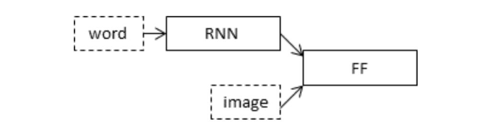
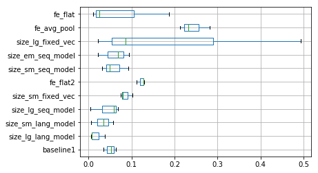
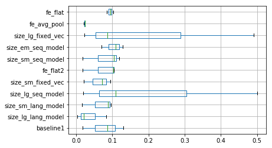

# Image Captioning Generator
Experiments with Neural Image captioning in Keras based on [Show and Tell](https://arxiv.org/abs/1411.4555).

# Python Environment
1. Python3
2. Keras 2.1.5 or Higher
3. Tensorflow 1.5 or Higher
4. scikit-learn
5. Pandas
6. NumPy
7. Matplotlib

[How to Setup a Python Environment for Machine Learning and Deep Learning with Anaconda](https://machinelearningmastery.com/setup-python-environment-machine-learning-deep-learning-anaconda/)

[How To Develop and Evaluate Large Deep Learning Models with Keras on Amazon Web Services](https://machinelearningmastery.com/develop-evaluate-large-deep-learning-models-keras-amazon-web-services/)

# Dataset
Flickr8K dataset
1. Flickr8k_Dataset.zip (1 Gigabyte) An archive of all photographs.
2. Flickr8k_text.zip (2.2 Megabytes) An archive of all text descriptions for photographs.

# Evaluation Metric
BLEU scores. For reference [Where to put the Image in an Image Caption Generator](https://arxiv.org/abs/1703.09137)

# Model

## Model Structure

# Experimentation Results

